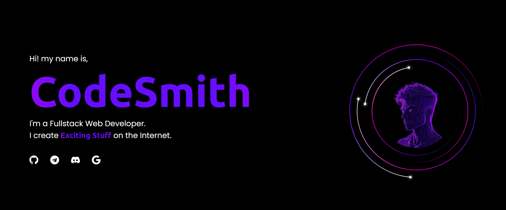

## 📈 Statistics

  

## 💻 Tech Stack

<h3>Web & Programming Languages</h3>
    

        &emsp;
        &emsp;
        &emsp;
        &emsp;
        &emsp;
        &emsp;
        &emsp;
        &emsp;
        &emsp;
    

 

<h3>Front-End Frameworks & Libraries</h3>
    

        &emsp;
        &emsp;
        &emsp;
        &emsp;
        &emsp;
        &emsp;
        &emsp;
        &emsp;
    

 

<h3>Back-End Frameworks & Libraries</h3>
    

        &emsp;
        &emsp;
        &emsp;
        &emsp;
        &emsp;
        &emsp;
        &emsp;
    

 

<h3>Databases & Libraries</h3>
    

        &emsp;
        &emsp;
        &emsp;
        &emsp;
        &emsp;
    

 

<h3>State Management & Utilities</h3>
    

        &emsp;
        &emsp;
        &emsp;
        &emsp;
    

 

<h3>Platforms & Hosting</h3>
    

        &emsp;
        &emsp;
        &emsp;
    

 

<h3>Tools & Software</h3>
    

        &emsp;
        &emsp;
        &emsp;
        &emsp;
        &emsp;
        &emsp;
        &emsp;
        &emsp;
        &emsp;
    

 

## 🐍 Contribution Snake
<picture>
  <source media="(prefers-color-scheme: dark)" srcset="https://raw.githubusercontent.com/CodeSmith/CodeSmith/output/github-contribution-grid-snake-dark.svg">
  <source media="(prefers-color-scheme: light)" srcset="https://raw.githubusercontent.com/CodeSmith/CodeSmith/output/github-contribution-grid-snake.svg">
  
</picture>
